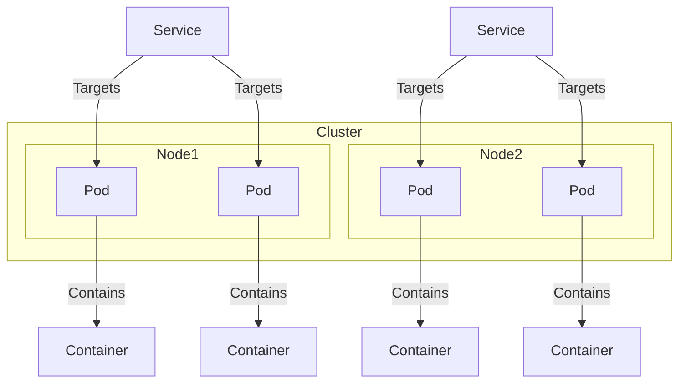

Sure! Here's a Mermaid diagram that illustrates the relationships between containers, pods, nodes, clusters, and services in Kubernetes:

This diagram shows:
- **Pods** running on different **Nodes** within a **Cluster**.
- Each **Pod** contains one or more **Containers**.
- **Services** target specific **Pods** to manage network traffic.

Feel free to ask if you need any more details or adjustments!
